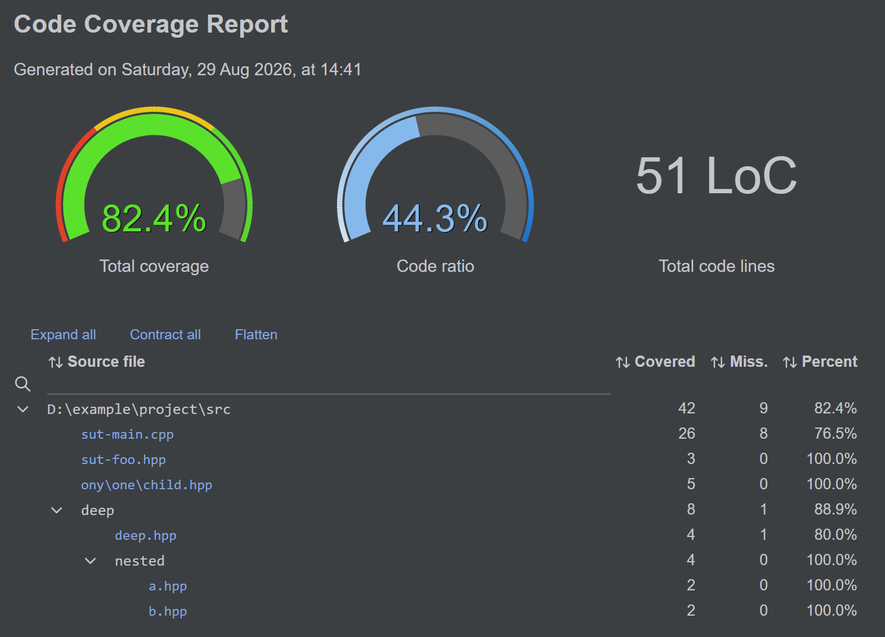
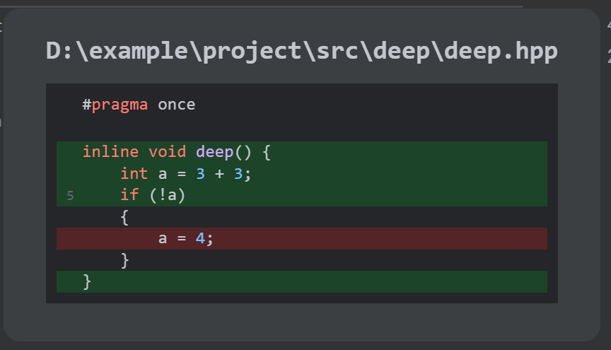

# Cover++

Code coverage engine for C/C++ on Windows.

A modern alternative to the abandoned [OpenCppCoverage](https://github.com/OpenCppCoverage/OpenCppCoverage) project.

**Go to:** [**Documentation**](https://coloredcarrot.github.io/coverpp/)

<picture>
  <source media="(prefers-color-scheme: dark)" srcset="docs/src/assets/view-main-dark.png">
  <source media="(prefers-color-scheme: light)" srcset="docs/src/assets/view-main-light.png">
  
</picture>

<picture>
  <source media="(prefers-color-scheme: dark)" srcset="docs/src/assets/view-file-dark.png">
  <source media="(prefers-color-scheme: light)" srcset="docs/src/assets/view-file-light.png">
  
</picture>

## Usage

### Report generation

You don't need to compile or link your program with any specific options.
Having an `.exe` and a `.pdb` is enough.

```bat
cover++ run -s path\to\sources my-program.exe
```

### Report visualization

```bat
cover++ view report.coverpp
```

### Export

```bat
cover++ export json report.coverpp -o report.json
```

For a complete list of commands and options,
see the [documentation](https://coloredcarrot.github.io/coverpp/reference/cli).

## Development

### Running tests

Cover++ integrates its various test suites with CTest,
allowing them to be conveniently run with one unified command.

```bat
mkdir build      # We want an out-of-source build
cd build
cmake ..         # Configure with default options (includes testing)
cmake --build .  # Build
ctest -C Debug   # Run all test suites
```

### Packaging

Cover++ uses CPack to generate installers.

```bat
mkdir build
cd build
cmake -DCMAKE_BUILD_TYPE=Release ..
cmake --build . --config Release
cpack
```

### Frontend

To develop the frontend or the documentation,
you need Node and pnpm:

```bat
winget install OpenJS.NodeJS.LTS
winget install pnpm.pnpm
```

You can then run development servers in the `frontend` and `docs` directories:

```bat
pnpm dev
```
